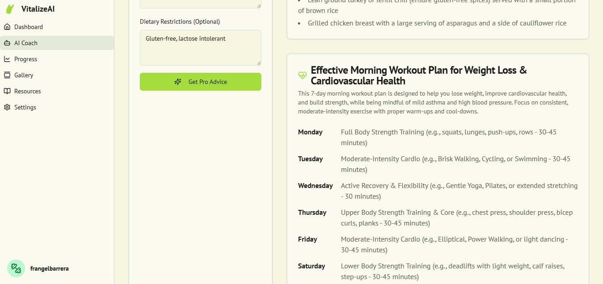
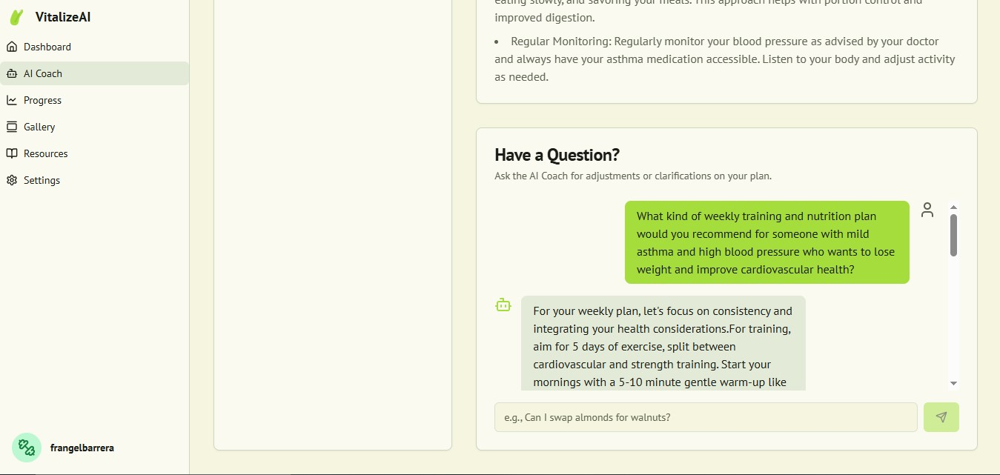
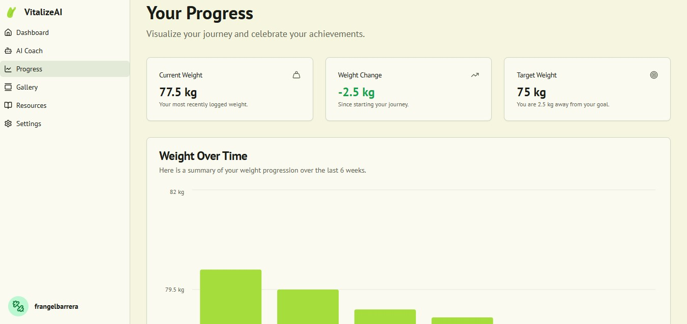
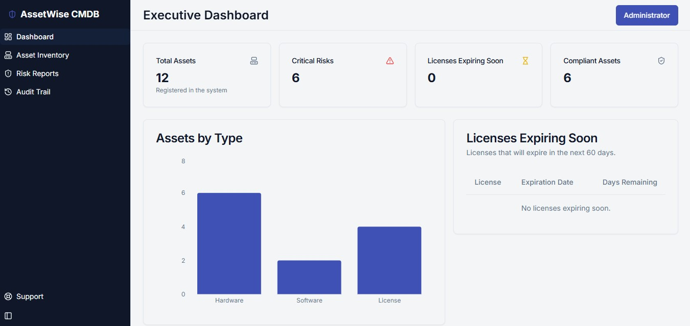
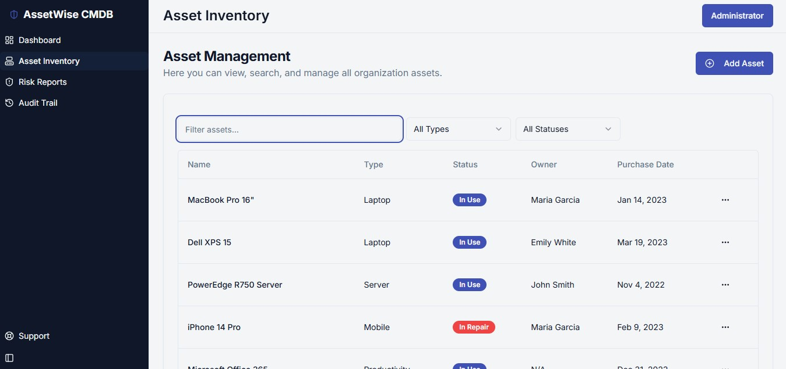
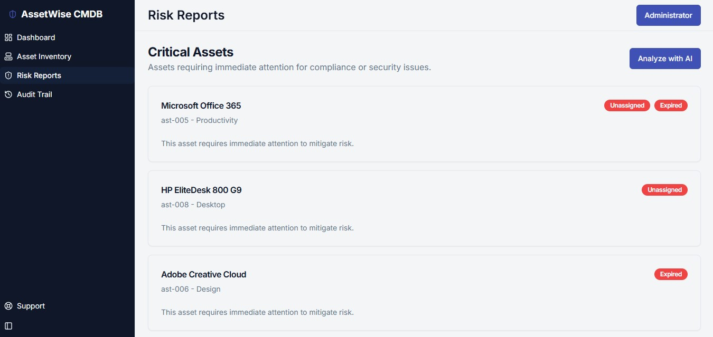
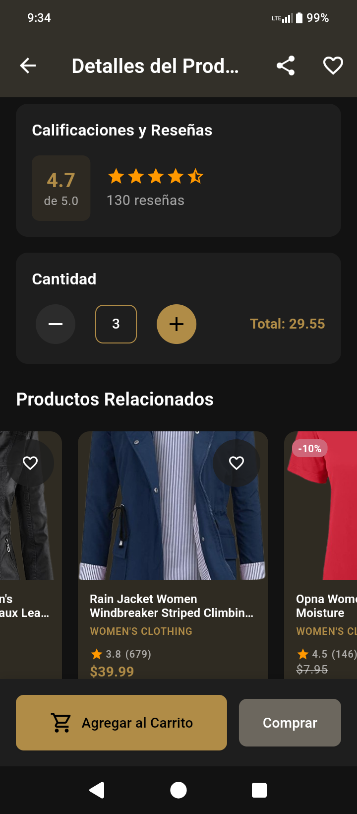
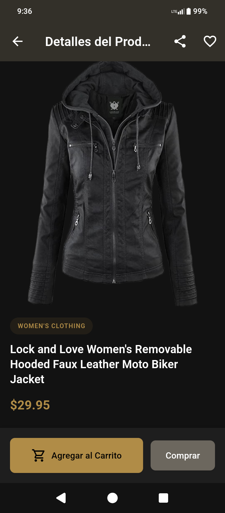

  

# Frangel Raúl Crespo Barrera

**Cybersecurity Engineer & Full-Stack Developer**

## Passion for Technology

I am passionate about secure software development, ethical hacking, and leveraging technology to solve complex problems. With a strong foundation in cybersecurity and full-stack development, I focus on building resilient, scalable solutions that prioritize security from the ground up (Security by Design). My journey combines offensive and defensive security techniques with modern development practices, AI integration, and automation to create impactful technological advancements.

## Core Skills & Technologies

### Programming Languages
 (5 years)
 (4 years)
 (4 years)
 (2 years)
 (4 years)
 (3 years)

### Frameworks & Libraries
 (3 years)
 (3 years)
 (3 years)
 (2 years)
 (3 years)
 (3 years)

### Cybersecurity & Security Tools
 (4 years)
 (4 years)
 (4 years)
 (4 years)
 (4 years)

### Cloud & DevOps
 (2 years)
 (2 years)
 (2 years)
 (2 years)

### Databases & AI
 (3 years)
 (2 years)
 (1 year)
 (2 years)
 (2 years)

## Professional Experience

### Cybersecurity Specialist - Defense and National Security Sector
*3 months*  
Conducted threat and vulnerability analysis for critical infrastructures, deployed perimeter security, developed forensic analysis tools, and contributed to Threat Intelligence and incident response projects.  
**Key Achievements:** Strengthened security posture for a network with 200+ industrial machines and 100+ workstations; improved investigative efficiency by 65% through automated investigations and AI integration.

### Full-Stack Development Engineer - SCADA Control System for Industrial Automation
*January 2024 – Present*  
Designed relational database architecture using Prisma ORM and Node.js/TypeScript for machinery management. Developed centralized SCADA system for real-time monitoring of 200 machines across 12 plants, integrating industrial protocols (Modbus/TCP, S7Comm) and applying ICS/OT cybersecurity.  
**Impact:** 15% reduction in machinery downtime through early fault detection.

### Security Automation Engineer - Offensive and Operational Cybersecurity (OT/ICS)
*January 2024 – December 2024*  
Developed 5+ security tools in Python for automation and testing. Created StyxLoaderX (C++/Windows API) for advanced threat simulation. Integrated with Elastic Stack for SIEM.  
**Impact:** 70% reduction in log analysis time through automation.

## Featured Projects

### VitalizeAI - Health & Wellness Optimization Tool
An internal tool for optimizing health tracking using AI, featuring personalized training and nutrition plans.

**Technologies:** Node.js, Express.js, AI APIs, NoSQL Database, Dynamic Rendering  
**Key Features:** AI-generated personalized plans, real-time progress tracking, conversational AI coach, educational resources.

**Screenshots:**
    
  

### AssetWise CMDB - Asset and Risk Management System
An internal tool for managing IT assets and risks, enhancing operational efficiency and compliance.

**Technologies:** Node.js, Express.js, NoSQL Database, AI Integration, REST APIs, Dynamic Rendering  
**Key Features:** Real-time metrics dashboard, intelligent asset inventory, automated risk reports, audit trails.

**Screenshots:**
  

### Mobile Shopping App - Flutter E-commerce Demo
A cross-platform shopping app demonstrating Flutter expertise, connected to FakeStoreAPI.

**Technologies:** Flutter, Dart, REST APIs, Material Design, Reactive State Management  
**Key Features:** Interactive catalog, shopping cart, real-time pricing, multilingual support.

**Screenshots:**
   

### PhishGuard - AI-Powered Phishing Detection
Thesis project applying CNN and LSTM for malicious URL classification.

**Technologies:** Python, TensorFlow, Keras, Flask, React  
**Impact:** 96.8% accuracy in detecting phishing URLs.

### AegisTrace - Threat Intelligence Platform
Platform for managing and analyzing Indicators of Compromise (IoCs).

**Technologies:** Python, FastAPI, PostgreSQL, React, Docker  

### Cloud-Misconfig-Scanner - Multi-Cloud Security Scanner
CLI tool for detecting security misconfigurations in AWS, Azure, GCP.

**Technologies:** Python, Boto3, Azure SDK, GCP Client Libraries  

## Education

**Cybersecurity Engineering**  
Universidad de Ciencias Informáticas (UCI), Havana, Cuba  
*September 2020 – June 2025*  

Thesis: "Phishing Detection using Deep Learning: CNN and LSTM for Malicious URL Classification"

## Certifications

- Ethical Hacker (Cisco Networking Academy)
- Artificial Intelligence Fundamentals (IBM SkillsBuild)
- Cyber Intelligence Course (University of Salamanca)

## Languages

- Spanish: Native
- English: B1 - Intermediate

## Contact

Available for remote opportunities worldwide. Actively seeking roles in cybersecurity, software development, and AI integration.

---

*This portfolio showcases my expertise in secure development, automation, and innovative technology solutions.*

