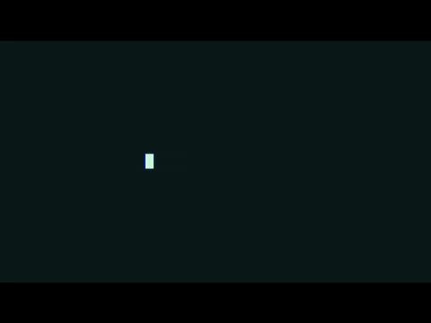
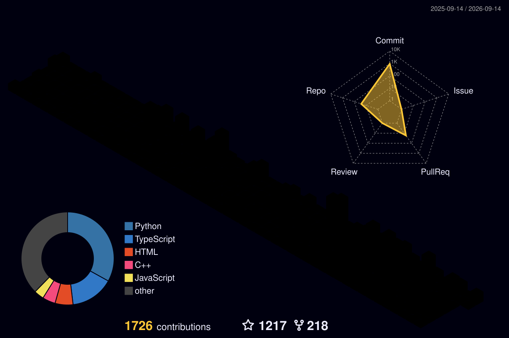

  

# Frangel Raúl Crespo Barrera

**Cybersecurity Engineer & Full-Stack Developer**

## Passion for Technology

I am passionate about secure software development, ethical hacking, and leveraging technology to solve complex problems. With a strong foundation in cybersecurity and full-stack development, I focus on building resilient, scalable solutions that prioritize security from the ground up (Security by Design). My journey combines offensive and defensive security techniques with modern development practices, AI integration, and automation to create impactful technological advancements.

## Tech Stack & Tools

  

## GitHub Metrics

  

 

<table align="center">
  <tr>
    <td align="center">
      
    </td>
    <td align="center">
      
    </td>
  </tr>
</table>

---

## Education

**Cybersecurity Engineering**  
Universidad de Ciencias Informáticas (UCI), Havana, Cuba    

Thesis: "Phishing Detection using Deep Learning: CNN and LSTM for Malicious URL Classification"

## Certifications

- Ethical Hacker (Cisco Networking Academy)
- Artificial Intelligence Fundamentals (IBM SkillsBuild)
- Cyber Intelligence Course (University of Salamanca)

## Languages

- Spanish: Native
- English: B1 - Intermediate

## Contact

Available for remote opportunities worldwide. Actively seeking roles in cybersecurity, software development, and AI integration.
https://linktr.ee/frangelbarrera

---

---

